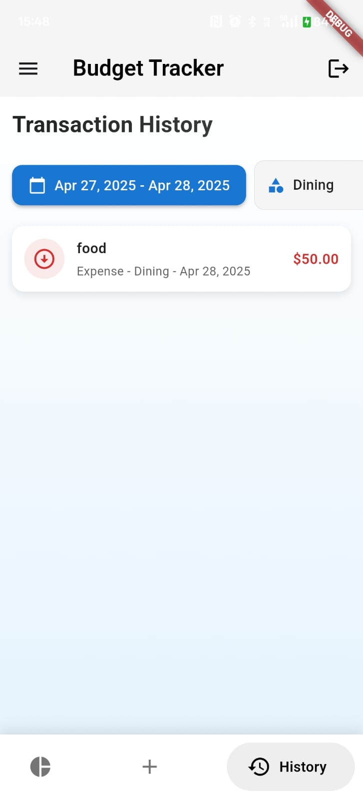
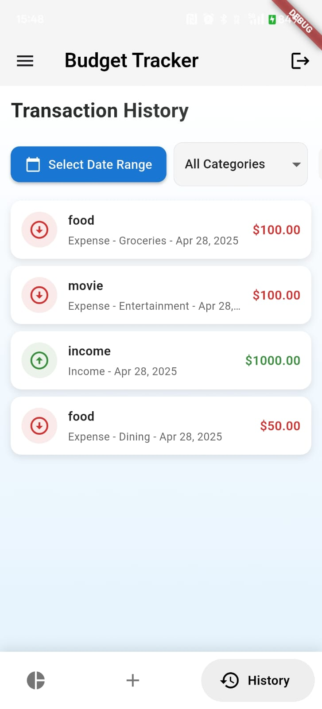
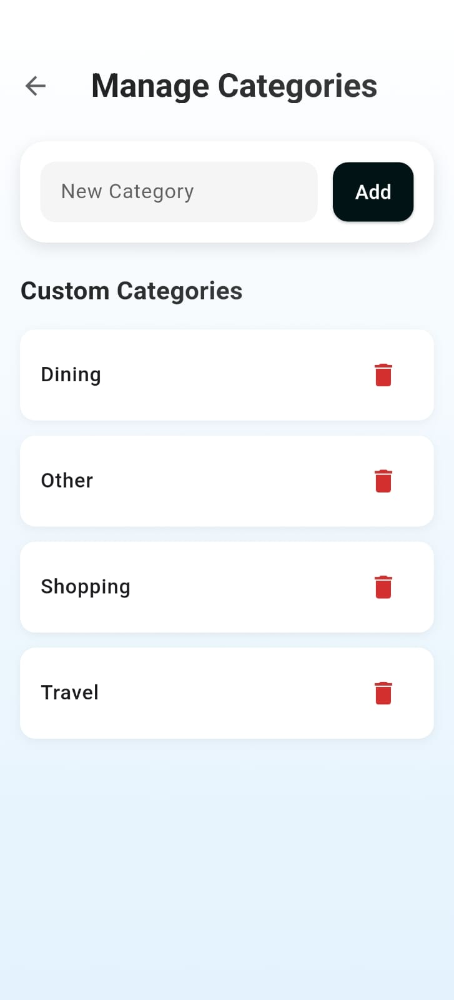
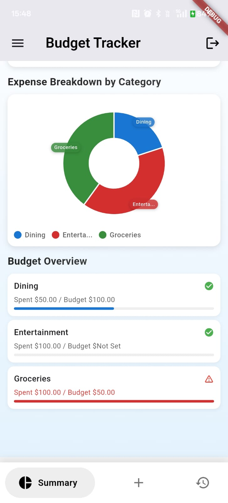
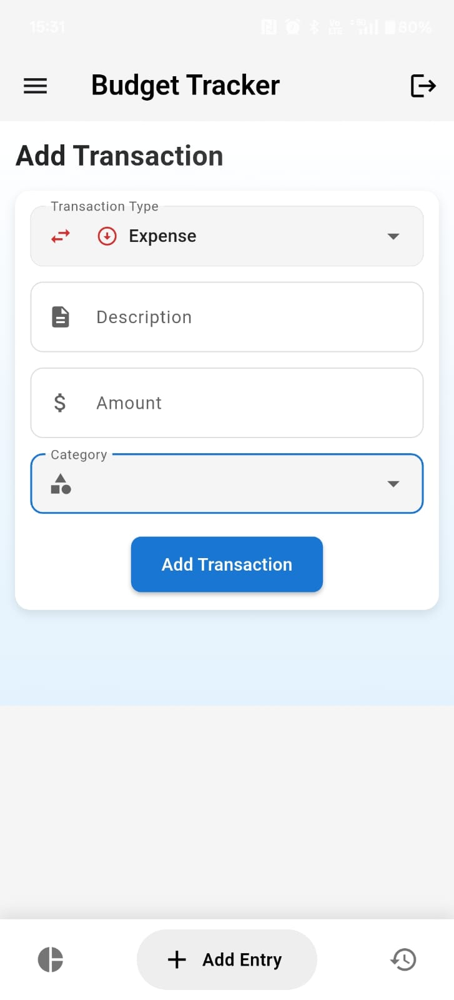
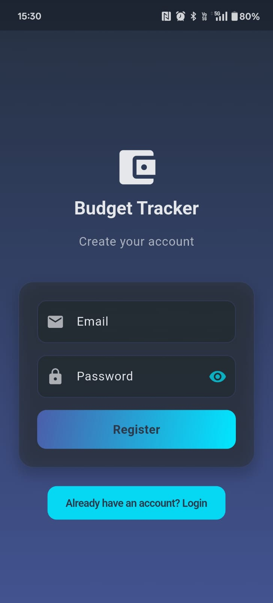
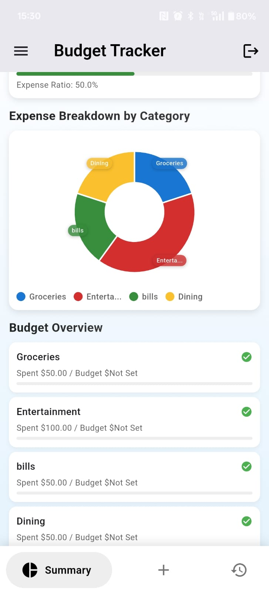
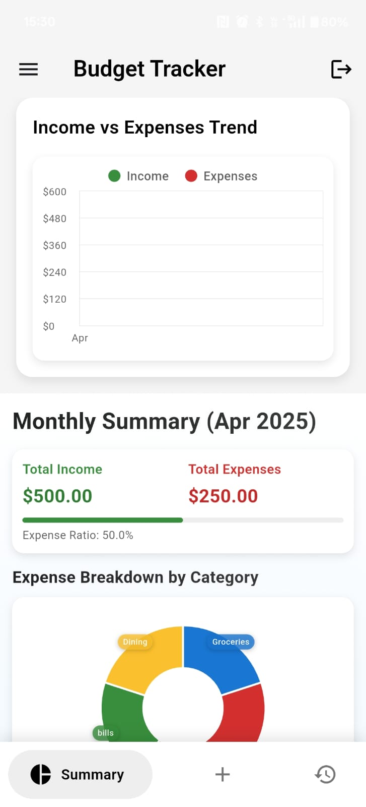
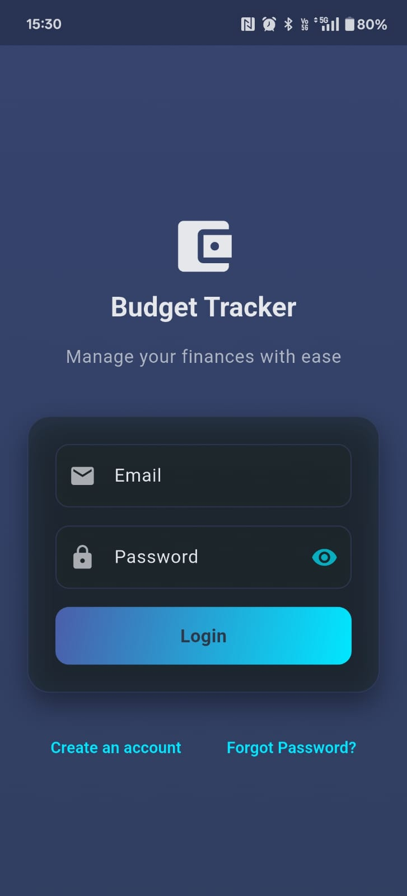

# budget_tracker

## About the App

**Budget Tracker** is a Flutter-based application designed to help users manage their finances effectively. The app provides an intuitive interface for tracking expenses, managing budgets, and analyzing spending patterns.

### Features

- **User Authentication**: Secure login and registration functionality.
- **Budget Management**: Create, edit, and manage budgets for different categories.
- **Expense Tracking**: Add, view, and categorize transactions.
- **Visual Insights**: Interactive pie charts and trend charts for analyzing spending habits.
- **History Overview**: View transaction history with detailed filters.
- **Category Management**: Add or modify spending categories to suit your needs.
- **Password Recovery**: Forgot password functionality for account recovery.
- **Responsive Design**: Optimized for both mobile and tablet devices.

This app is ideal for anyone looking to take control of their personal finances with ease and efficiency.

## App Screenshots

Here are some screenshots of the app:

